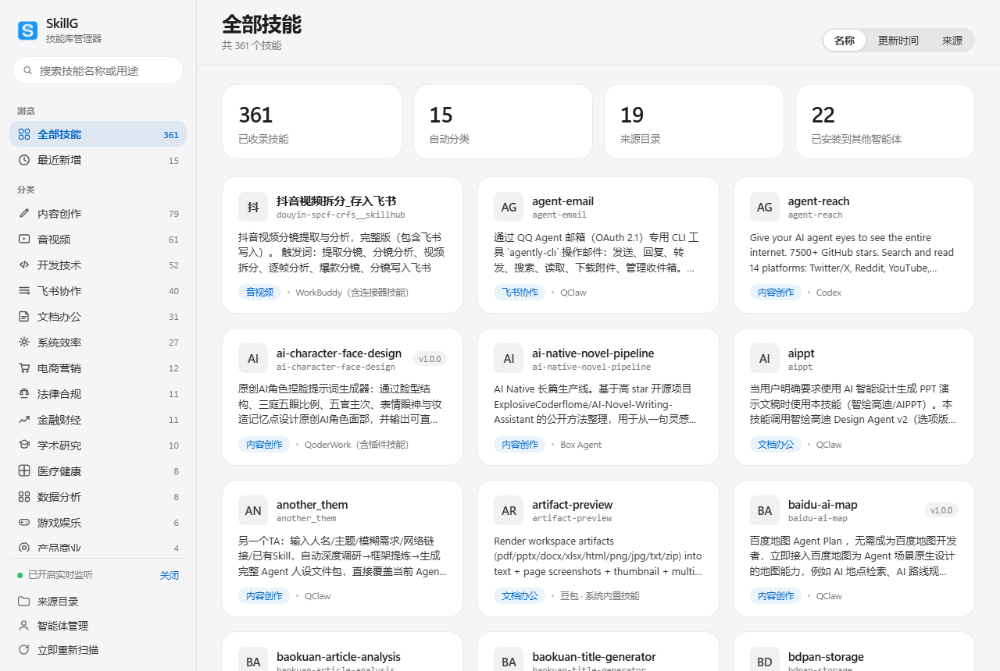
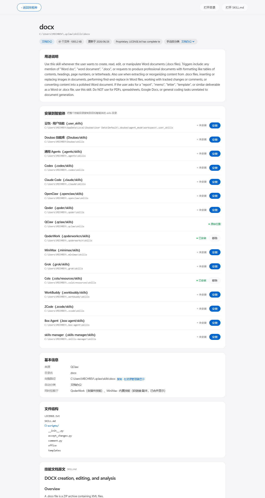

# SkillG · 本地 Skill 分类管理器

一个运行在你电脑上的技能库管理软件：自动扫描各个 skills 目录、识别用途并分门别类；
新装技能会被实时发现并自动归类；点开任意技能可查看用途、来源、文件结构与 SKILL.md 原文，
并可一键安装（复制）到指定智能体的 skills 目录。

界面遵循 Apple 设计语言（依据 VoltAgent/awesome-design-md 的 apple/DESIGN.md：
Action Blue #0066cc、#f5f5f7 羊皮纸底色、18px 卡片圆角、胶囊按钮、毛玻璃顶栏、无装饰渐变）。

## 界面预览





## 启动

### 方式一：直接用打包好的 exe（推荐普通用户）

从 Release 下载 `SkillG.exe` 单文件到任意目录，**双击即可运行**：无需安装 Python、
无需任何依赖，首次启动会在 exe 同级生成 `data/`（你的配置）。弹原生桌面窗口；
重复双击只会唤起已在运行的实例，不会开第二个。

### 方式二：源码运行（开发/调试）

| 方式 | 文件 | 说明 |
|---|---|---|
| 日常使用（推荐） | `启动SkillG.bat` | 双击即可。优先弹出原生桌面窗口，无黑色控制台 |
| 排查问题 | `调试模式-显示日志.bat` | 带控制台，可看到扫描日志与报错 |
| 强制浏览器打开 | `浏览器模式-排障.bat` | 不使用原生窗口，改由默认浏览器打开 |

- 后端只用 Python 标准库，**无需 pip 安装任何依赖**即可运行（需要本机有 Python 3.9+）。
- 原生桌面窗口为可选项：执行一次 `python -m pip install pywebview`（Win11 自带 WebView2 运行时）。
  未安装时程序会自动改为在默认浏览器打开，功能完全一致。
- 服务只监听 `127.0.0.1`，端口 18765 被占用时会自动顺延。

### 自己打包单文件 exe

```bash
pip install pyinstaller pywebview pythonnet
python -m PyInstaller --noconfirm --onefile --windowed --name SkillG ^
  --icon skillg.ico --add-data "web;web" ^
  --hidden-import clr --hidden-import webview.platforms.edgechromium ^
  --collect-submodules webview --collect-all pythonnet app.py
# 产物：dist/SkillG.exe
```

> 文件夹选择框做了双通道：优先 tkinter，遇到裁剪版 Python（缺 Tcl/Tk 脚本库）
> 会自动回退到 Windows 自带的 Shell 对话框（PowerShell），因此打包时无需强塞 tkinter。

## 功能一览

1. **自动扫描与分类**：启动即扫描全部来源目录（豆包、Codex、Claude Code、OpenClaw、Qoder、
   QClaw、QoderWork、MiniMax、Grok、Cola、WorkBuddy、ZCode、Box Agent、skills-manager、
   商汤小浣熊等 19 个来源），解析每个 `SKILL.md` 的
   `name / version / description / metadata`，按用途关键词自动归入 14 个分类。
   技能内部的 `sub-skills / branches / references` 子模块不会被误判为独立技能；
   `.system / .builtin-skills` 等隐藏内置目录同样会被扫到。
   **同名/软链接自动合并**：Junction 软链接指向同一物理目录、或同一技能被复制进多个 Agent 时，
   只显示一张卡片，详情页“基本信息-同时挂载于”列出其余位置，安装矩阵显示各 Agent 实际安装状态。
2. **实时监听新技能**：默认每 5 秒轻量比对一次目录。你（或豆包）新装技能后，
   右下角弹出提示“检测到新技能，已自动归类到 XX”，点“查看”即达。可在左下角临时关闭监听。
3. **技能详情**：用途说明、版本、来源目录、完整路径（可复制/在资源管理器打开）、
   文件数量与体积、更新时间、依赖命令、两层文件结构树，以及渲染后的 SKILL.md 全文。
4. **安装到智能体**：详情页列出全部 16 个目标智能体（豆包/Doubao/.agents/Codex/Claude Code/
   OpenClaw/Qoder/QClaw/QoderWork/MiniMax/Grok/Cola/WorkBuddy/ZCode/Box Agent/skills-manager），
   点“安装”会把整个技能目录复制到该智能体的 skills 目录；已安装的可“移除”（只删副本，
   原始技能不动）。在“智能体管理”里增删目标。
5. **手动调整分类**：详情页“手动改分类”下拉即可调整，选择会写入配置永久生效，
   重新扫描也不会被覆盖（调回自动推断分类即恢复自动）。
6. **搜索 / 排序 / 来源管理**：名称、目录名、用途全文搜索；按名称/时间/来源排序；
   “来源目录”中可加入任意自定义 skills 文件夹一起纳管——路径输入框右侧的 **＋** 按钮
   会直接弹出系统文件夹选择窗口，选中即自动填入路径并补全建议名称（添加智能体同理）。

## 自动分类体系

飞书协作 · 医疗健康 · 法律合规 · 学术研究 · 金融财经 · 电商营销 · 音视频 ·
内容创作 · 文档办公 · 数据分析 · 产品商业 · 开发技术 · 系统效率 · 游戏娱乐 · 其他

分类采用“名称命中权重 ×2 + 描述命中权重 ×1，取最高分”的规则，英文关键词按词边界匹配
（不会把 Wikipedia 误判为 wiki 类）。规则在 `app.py` 顶部 `CATEGORIES`，可自行增删。

## 数据存在哪

- `data/config.json`：来源目录、智能体列表、手动分类覆盖、监听开关。删除即恢复出厂。
- 程序**只读**来源目录中的技能；“安装”只做目录复制，不会移动或改动原始技能。

## 目录结构

```
SkillG/
├─ app.py                  后端：扫描/分类/监听/安装/HTTP API（标准库零依赖）
├─ web/
│  ├─ index.html           界面结构
│  ├─ app.css              Apple 风格样式（设计 token 对应 apple/DESIGN.md）
│  └─ app.js               交互、渲染、极简 Markdown 渲染
├─ data/                   配置与运行数据（自动生成）
├─ 启动SkillG.bat
├─ 调试模式-显示日志.bat
└─ 浏览器模式-排障.bat
```

## 常见问题

- **窗口打不开 / 白屏**：用“浏览器模式-排障.bat”，把控制台报错发出来；也可直接访问
  控制台打印的 `http://127.0.0.1:187xx`。
- **某个技能没被扫到**：扫描覆盖来源目录下两层（如 `.grok/bundled/skills/<技能>`、
  `.cola/resources/skills/<技能>` 均可识别），隐藏目录也会扫描；更深层的目录
  （如 WorkBuddy 的 connectors-marketplace 下载缓存、QClaw 的 workspace-* 临时工作区）
  为避免重复与噪音默认不纳管，需要时在“来源目录”里把具体 skills 文件夹单独加进来即可。
  确认目录里有名为 `SKILL.md` 的文件后，点左下角“立即重新扫描”。
- **分类不准**：在详情页手动改分类，一劳永逸；或修改 `app.py` 的 `CATEGORIES` 关键词。
